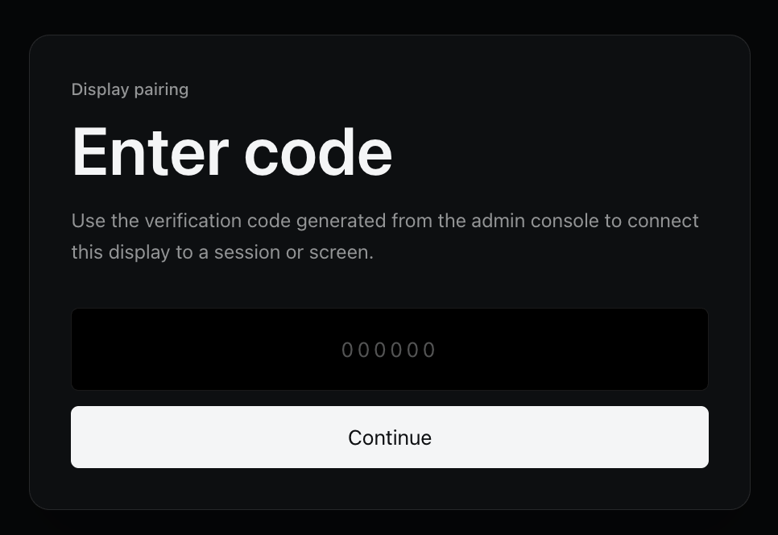
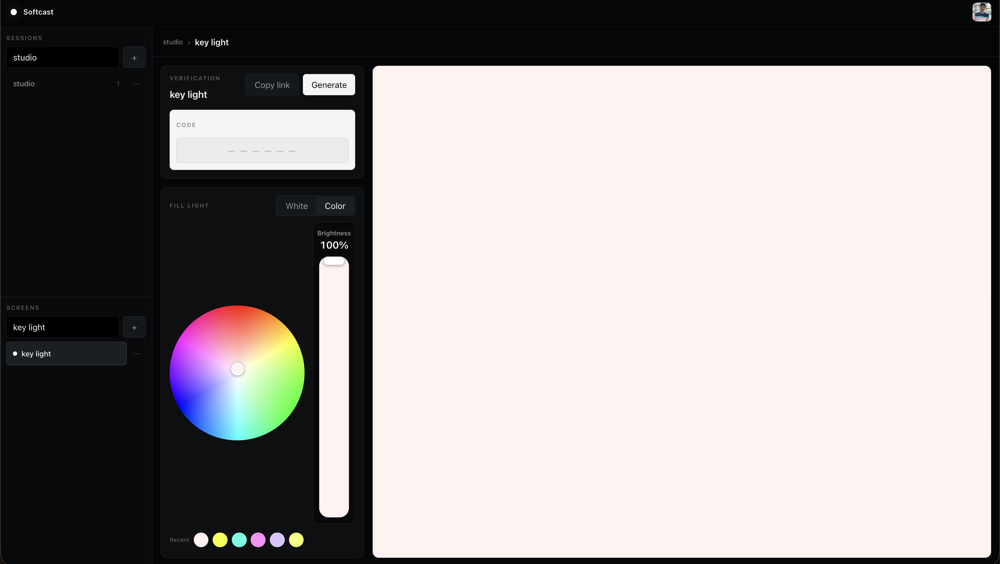

# Softcast

**Turn any screen with a browser into a remotely controlled fill light.**

A TV, tablet, phone, laptop, or projector becomes a lighting surface. Softcast fills that display with a single white or color, and you drive it from a web console. There is nothing to install on the display — open a page, pair it, go fullscreen.

The hosted product is at [softcast.studio](https://softcast.studio). There is a walkthrough on YouTube: [I Made My TV Work Like a DMX Light](https://www.youtube.com/watch?v=t31eALOBhKw).

[](https://www.youtube.com/watch?v=t31eALOBhKw)

## Pair a display

On the device that should become the light, open Softcast and enter the six-digit code from the console. The code is single-use and expires after five minutes. You can also paste a session or screen link directly.



## Control the light

Sign in to the admin console to create a **session** (a room or shoot) and one or more **screens** (individual lights). Set the fill from there. White mode is a Kelvin fader with common cinema presets; color mode is a hue and saturation wheel. Brightness applies to both. The large pane is a live preview of what the display will show.



Changes reach paired displays about twice a second. Anyone with a valid session or screen link can view the light. Only the signed-in owner can change it.

## How a shoot comes together

1. Create a session and add a screen for each physical display.
2. Generate a verification code, or copy the session or screen link.
3. On each display, enter the code (or open the link). The page becomes the light.
4. Drag Kelvin, the color wheel, or brightness. Displays update live.

A session is a grouping, not a light. Each screen owns one lighting state. Display names are just labels — they can repeat. The IDs in the URL are random and are what actually address a session or screen.

On a lighting surface, **F** toggles fullscreen, **Enter** or **Space** toggles the status overlay, and **Escape** leaves fullscreen. The overlay hides on its own after a few seconds so the screen reads as a clean fill.

## Lighting

Softcast stores one static fill per screen. There are no effects, animations, or server-side presets.

| Field | Range | When it applies |
| --- | --- | --- |
| `mode` | `cct` or `color` | White versus hue/saturation |
| `temperature` | 1800–10000 K | White mode |
| `hue` | 0–360 | Color mode |
| `saturation` | 0–1 | Color mode |
| `brightness` | 0–1 (UI shows 0–100%) | Both modes |

Recent swatches in the console are a local convenience. They never go to the server.

Dragging a control updates the console immediately. Writes are coalesced: one request in flight, latest value wins, so a slow link does not flood or yank the dials backward.

## Run it locally

You need [Bun](https://bun.sh), a [Clerk](https://clerk.com) application (email or social sign-in is enough), and an [Upstash Redis](https://upstash.com) database.

```bash
cp .env.example apps/web/.env.local
# fill the values below
bun install
bun run dev
```

Then open [http://localhost:3000](http://localhost:3000) to pair a display, or [http://localhost:3000/admin](http://localhost:3000/admin) to sign in.

Required environment variables in `apps/web/.env.local`:

```bash
NEXT_PUBLIC_CLERK_PUBLISHABLE_KEY=
CLERK_SECRET_KEY=
PUBLIC_WEB_URL=http://localhost:3000
KV_REST_API_URL=
KV_REST_API_TOKEN=
```

`PUBLIC_WEB_URL` is the origin written into session and screen links. Redis also accepts the `UPSTASH_REDIS_REST_URL` / `UPSTASH_REDIS_REST_TOKEN` names. You only need one of the two Redis pairs.

Clerk protects `/admin` and the owner API. Pairing, session lists, and lighting polls stay public so a TV or tablet never has to sign in.

## Project layout

```
apps/web              Next.js app: console, pairing, displays, and the HTTP API
packages/protocol     Shared lighting types, validation, color math, renderer HTML
```

The stack is Next.js 16, React 19, Tailwind CSS v4, Clerk, and Upstash Redis over REST. Displays poll; there is no WebSocket.

Routes:

| Path | Who | What |
| --- | --- | --- |
| `/` | Anyone | Pair a display with a verification code |
| `/admin` | Signed-in owner | Sessions, screens, codes, lighting controls |
| `/session/:sessionId` | Anyone with the link | Pick a screen — not a light itself |
| `/screen/:sessionId/:screenId` | Anyone with the link | Fullscreen lighting surface |
| `/sign-in`, `/sign-up` | Anyone | Clerk authentication |

On wide viewports the console is three panes: library, controls, preview. Below 1280px it becomes a Library / Control / Preview tab strip so nothing clips on a phone or a zoomed laptop.

## API

Owner routes use the same-origin Clerk session cookie. The server reads the user from that session. It never trusts an `ownerId` from the client.

```
GET    /api/admin/sessions
POST   /api/admin/sessions                         { name }
DELETE /api/admin/sessions/:sessionId
POST   /api/admin/sessions/:sessionId/screens      { name }
DELETE /api/admin/sessions/:sessionId/screens/:screenId
PUT    /api/admin/sessions/:sessionId/screens/:screenId/state   { state }
POST   /api/admin/codes                            { sessionId, screenId? }
```

Public routes:

```
POST   /api/codes/redeem                           { code }
GET    /api/sessions/:sessionId/screens
GET    /api/sessions/:sessionId/screens/:screenId/state
GET    /api/health
```

`GET /api/health` pings Redis and returns `503` when it is down. Names are limited to 80 characters. Lighting payloads are clamped through `@softcast/protocol` before they are stored. Public responses never include Clerk IDs or ownership fields.

Treat session and screen URLs as capability links. Anyone who has one can read that screen's current color.

## Redis

Keys use the `softcast:` prefix. Sessions and screens persist until the owner deletes them. Codes live for five minutes and are consumed on redeem.

```
softcast:user:{clerkUserId}:sessions
  ZSET    session ids, scored by createdAt          (index only)

softcast:session:{sessionId}
  HASH    ownerId, name, createdAt                  (ownership lives here)

softcast:session:{sessionId}:screens
  ZSET    screen ids, scored by createdAt

softcast:session:{sessionId}:screen:{screenId}
  HASH    name, createdAt

softcast:session:{sessionId}:screen:{screenId}:state
  HASH    mode, temperature, hue, saturation, brightness, revision, updatedAt

softcast:code:{sixDigitCode}
  STRING  JSON target, 300s TTL, single-use GETDEL
```

Creates, deletes, and state writes run in Lua so the owner check and the write happen together.

## Deploy your own

The hosted site runs on Vercel with Upstash Redis and Clerk. `vercel.json` already has the install and build commands.

Set the same variable names as local development, with `PUBLIC_WEB_URL` pointing at your public origin. `NEXT_PUBLIC_*` values are baked in at build time — change them, then publish a new deployment.

A short production checklist lives in [deploy/DEPLOY.md](deploy/DEPLOY.md).

## Development

```bash
bun run typecheck
bun packages/protocol/src/smoke-test.ts
```

`bun run test:api` expects a Next server you already started. Without extra tokens it only checks that admin routes reject anonymous callers. Set `BACKEND_AUTH_TOKEN` (and optionally `BACKEND_OTHER_AUTH_TOKEN`) to exercise the owner flow and the cross-user `403`.

## License

[MIT](LICENSE)
